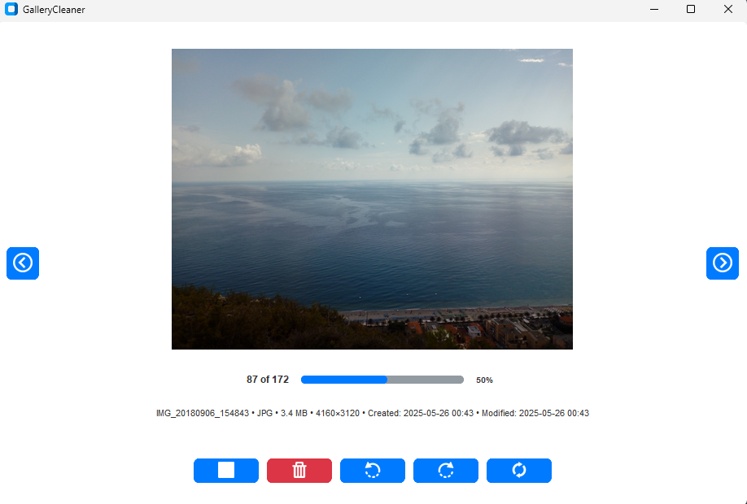

# PictureCleaner

**A streamlined media cleanup tool designed for efficiency and speed**

## Problem & Solution

Managing large collections of photos and videos can be overwhelming. Traditional file management approaches force you to navigate through endless folders, right-click menus, and confirmation dialogs, making the cleanup process tedious and time-consuming.

**PictureCleaner** solves this problem by providing a purpose-built interface optimized for rapid media review and deletion. With keyboard shortcuts, streamlined navigation, and an intuitive preview system, you can quickly skim through your media collection and remove unwanted files without the friction of traditional file managers.

## Table of Contents

- [Features](#features)
- [Screenshots](#screenshots)
- [Technologies](#technologies)
- [Installation](#installation)
- [Usage](#usage)
- [Developer](#developer)

## Features

### **Efficiency-First Design**
- **Keyboard Navigation**: Use `A`/`D` or arrow keys to navigate between files
- **One-Key Deletion**: Press `S` to delete current file instantly
- **Minimal Cursor Movement**: All actions accessible via keyboard shortcuts
- **No Confirmation Dialogs**: Streamlined workflow without interrupting pop-ups

### **Smart Media Preview**
- **Real-time Preview**: Instantly view images and videos as you navigate
- **Responsive Layout**: Automatically scales to fit your screen
- **Multi-format Support**: Handles various image and video formats
- **Thumbnail Generation**: Quick loading for large media files

### **Safe & Reliable**
- **Trash Integration**: Files moved to system trash (not permanently deleted)
- **Undo Capability**: Easy recovery of accidentally deleted files
- **Error Handling**: Graceful handling of corrupted or inaccessible files
- **Session Recovery**: Remembers your position in large directories

### **Modern Interface**
- **Clean Design**: Distraction-free environment focused on content
- **System Theme Support**: Adapts to your OS appearance preferences
- **Responsive Layout**: Works on various screen sizes and resolutions
- **Professional Icons**: Intuitive visual indicators for all actions

## Screenshots



*PictureCleaner's clean and intuitive interface showing the main preview area with navigation controls*

## Technologies

**Core Framework:**
- **Python 3.7+** - Primary programming language
- **CustomTkinter** - Modern GUI framework with native look and feel

**Media Processing:**
- **Pillow (PIL)** - Advanced image processing and format support
- **Send2Trash** - Safe file deletion with system trash integration

**Additional Features:**
- **Threading** - Responsive UI with background processing
- **OS Integration** - Native file system operations

## Installation

### Prerequisites
- Python 3.7 or higher
- Windows, macOS, or Linux

### Quick Setup

1. **Clone the repository:**
   ```bash
   git clone https://github.com/yourusername/PictureCleaner.git
   cd PictureCleaner
   ```

2. **Run the setup script:**
   ```bash
   setup.bat
   ```
   
   This will automatically:
   - Create a virtual environment
   - Install all required dependencies
   - Set up the application for first use

### Manual Installation

If you prefer manual setup:

1. **Create virtual environment:**
   ```bash
   python -m venv venv
   ```

2. **Activate virtual environment:**
   - Windows: `venv\Scripts\activate`
   - macOS/Linux: `source venv/bin/activate`

3. **Install dependencies:**
   ```bash
   pip install -r requirements.txt
   ```

## Usage

### Starting the Application

**Quick Start:**
```bash
run.bat
```

**Manual Start:**
```bash
# Activate virtual environment first
venv\Scripts\activate

# Run the application
python src/main.py
```

### Navigation Controls

| Key | Action |
|-----|--------|
| `A` or `←` | Previous file |
| `D` or `→` | Next file |
| `S` or `↓` | Delete current file |
| `R` | Rotate current image 90° right |
| `Shift` + `R` | Rotate current image 90° left |
| `Shift` + Rotate Button | Rotate in opposite direction (visual feedback) |


### Workflow

1. **Select Directory**: Choose the folder containing media files to review
2. **Navigate**: Use `A`/`D` keys to move between files
3. **Preview**: View images and videos in the main preview area
4. **Delete**: Press `S` to move unwanted files to trash
5. **Continue**: Repeat until your media collection is cleaned

### Tips for Maximum Efficiency

- **Use keyboard shortcuts exclusively** - avoid mouse clicks during review
- **Work in focused sessions** - clean one directory at a time
- **Preview quickly** - trust your first impression for faster decisions
- **Regular cleanup** - prevent accumulation of unwanted files

## Developer

Created by [LorenBll](https://github.com/LorenBll)
